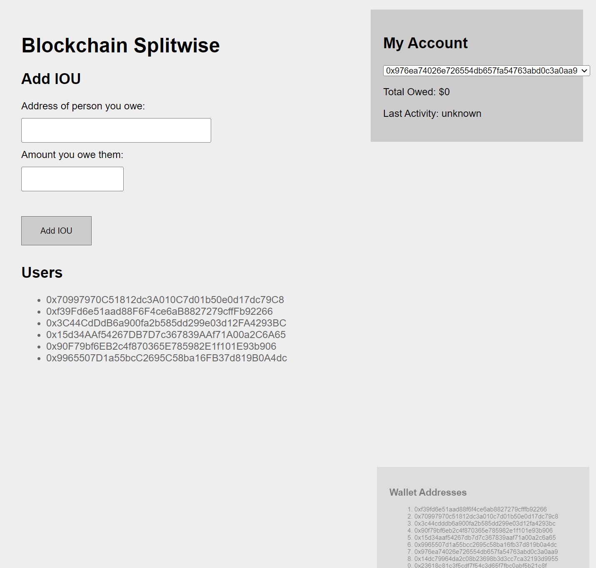

## Stanford University, CS251 Project 3: An Ethereum payment app

Install package

```
yarn install
```

Run a local Ethereum network node

```
yarn hardhat node
```

Deploy token smart contract on local network

```
yarn hardhat run scripts/deploy.js --network localhost
```


Copy your abi, smart contract's address (You can find them in folder `artifacts/contracts/contract_name.sol`)

Run `web_app/index.html`


